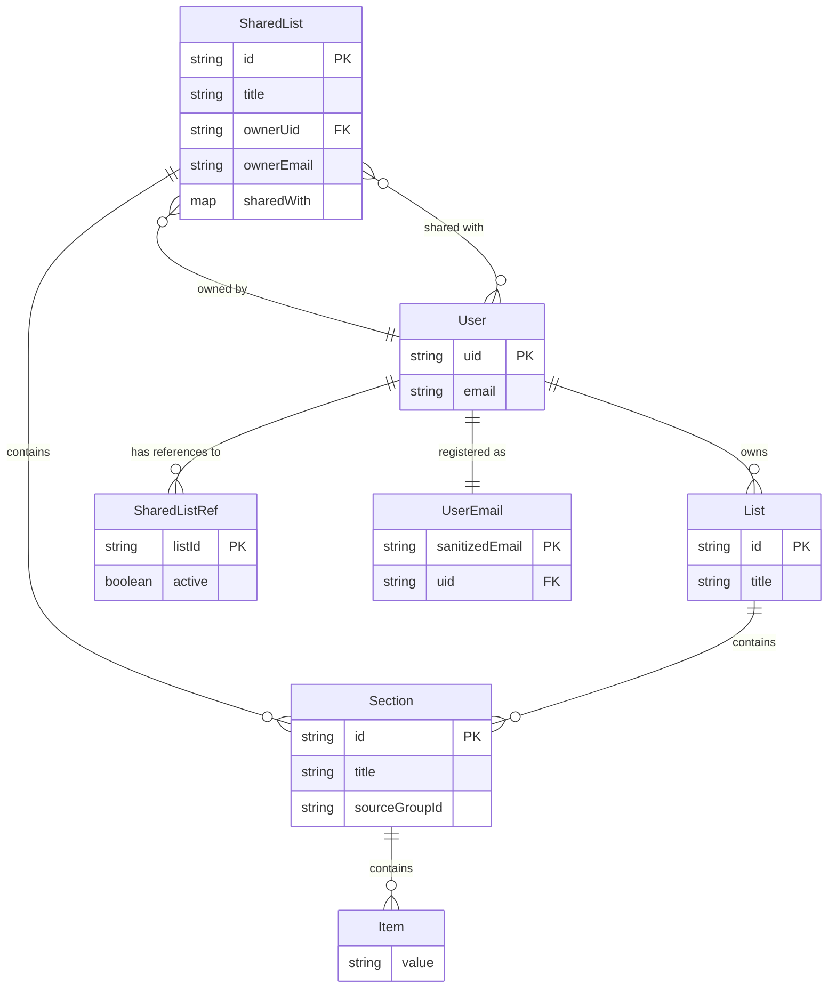

# TripReady

Web application to help you prepare your trips by organizing travel checklists into lists and groups.

## Tech Stack

- **Framework**: Angular 16
- **UI**: Angular Material 16 + CDK (drag & drop)
- **Backend**: Firebase Realtime Database
- **Auth**: Firebase Authentication (email/password + Google)
- **Package Manager**: Yarn
- **Testing**: Karma + Jasmine

## Features

- User authentication (login, register, Google sign-in)
- Create and manage travel lists
- Organize list items into sections and groups
- Drag and drop items between groups
- Delete lists and shared lists via drag-and-drop to trash
- Share lists with other users by email
- Collaborative editing on shared lists
- Owner-only deletion for shared lists (non-owners get a notification)
- Data scoped per authenticated user

## Project Structure

```
src/app/
├── guards/            # Auth route guard
├── services/
│   ├── auth.service   # Authentication + email-to-UID lookup
│   └── share.service  # List sharing, deletion, and lookup
└── views/
    ├── login/         # Login/register page
    ├── main-menu/     # Home screen with navigation
    ├── lists/         # Travel lists overview (own + shared)
    ├── list/          # Single list with sections
    │   └── dialog-share-list/  # Share list dialog
    └── group/         # Group management with drag & drop
```

## Getting Started

```bash
yarn install    # Install dependencies
yarn start      # Start dev server at http://localhost:4200
```

Firebase config goes in `src/environments/environment.ts`.

## Commands

```bash
yarn start        # Dev server
yarn build        # Development build
yarn build:prod   # Production build
yarn test         # Run tests (Karma)
yarn test:prod    # Headless tests with coverage
```

## Entity Relation Diagram

The data model uses Firebase Realtime Database with the following structure. Each user owns private lists stored under their UID. When a list is shared, a copy is written to a top-level `sharedLists/` node with ownership and collaborator metadata. A `userEmails/` node maps sanitized emails (dots replaced with commas) to UIDs for user lookup during sharing.



**Firebase paths:**

| Path | Description |
|------|-------------|
| `users/{uid}/lists/{listId}` | Private lists per user |
| `sharedLists/{listId}` | Shared list data with ownership metadata |
| `users/{uid}/sharedListIds/{listId}` | References to shared lists a user can access |
| `userEmails/{sanitizedEmail}` | Email-to-UID lookup for sharing |

For a detailed interactive diagram with sequence flows, see [`docs/shared-lists-model.html`](docs/shared-lists-model.html).

## Contributing

Contributions are welcome! Please feel free to open issues or submit pull requests for any improvements or bug fixes.

## License

This project is licensed under the MIT License. See the [LICENSE](LICENSE) file for details.
